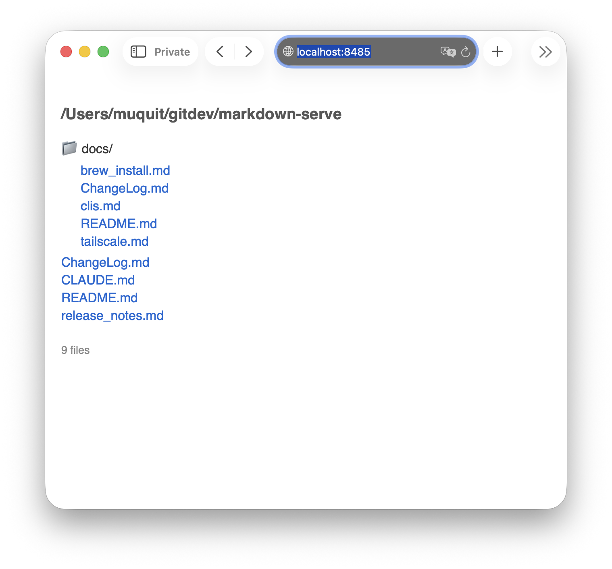
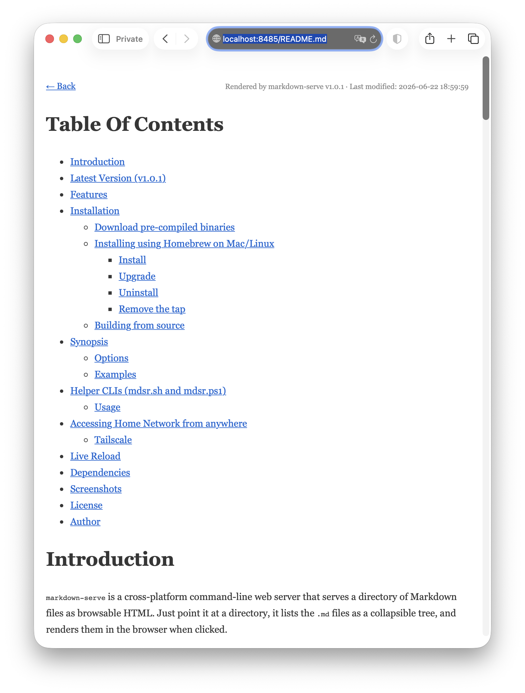

# Table Of Contents
- [Introduction](#introduction)
- [Latest Version (v1.0.1)](#latest-version-v101)
- [Features](#features)
- [Installation](#installation)
  - [Download pre-compiled binaries](#download-pre-compiled-binaries)
  - [Installing using Homebrew on Mac/Linux](#installing-using-homebrew-on-maclinux)
    - [Install](#install)
    - [Upgrade](#upgrade)
    - [Uninstall](#uninstall)
    - [Remove the tap](#remove-the-tap)
  - [Building from source](#building-from-source)
- [Synopsis](#synopsis)
  - [Options](#options)
  - [Examples](#examples)
- [Helper CLIs (mdsr.sh and mdsr.ps1)](#helper-clis-mdsrsh-and-mdsrps1)
  - [Usage](#usage)
- [Accessing Home Network from anywhere](#accessing-home-network-from-anywhere)
  - [Tailscale](#tailscale)
- [Live Reload](#live-reload)
- [Dependencies](#dependencies)
- [Screenshots](#screenshots)
- [License](#license)
- [Author](#author)

# Introduction

`markdown-serve` is a cross-platform command-line web server that serves a directory of Markdown files as browsable HTML. Just point it at a directory, it lists the `.md` files as a collapsible tree, and renders them in the browser when clicked. 

I prefer `vi/vim` in a terminal over [VS Code](https://code.visualstudio.com/) and such for writing Markdown, and 
like to see how the output is rendered in the browser.  The server watches 
for file changes by default and reloads the browser automatically via [Server-sent events](https://en.wikipedia.org/wiki/Server-sent_events). 

I find it much more pleasurable to work that way. Hope you find it useful as well.

Suggestions, pull requests are welcome but please keep in mind that I like to keep things simple.

# Latest Version (v1.0.1)

The latest version is v1.0.1 - released on Jun-26-2026 


# Features

- Lists `.md` files as a collapsible tree (directories and files)
- Renders Markdown as clean HTML
- Syntax highlighting via [highlight.js](https://highlightjs.org) loaded from CDN
- GitHub-flavored Markdown extensions: tables, strikethrough, task lists, fenced code blocks, auto-heading IDs
- Live reload via [Server-sent events](https://en.wikipedia.org/wiki/Server-sent_events) when files change on disk (on by default)
- Recursive directory support with empty directory pruning
- Path traversal protection
- Binds to `0.0.0.0` by default so you can access it remotely
- `mdsr.sh`/`mdsr.ps1` helper scripts to restart `markdown-serve` without manually killing a running instance first

# Installation

## Download pre-compiled binaries

Download a pre-built binary for your platform from [Releases](https://github.com/muquit/markdown-serve/releases) page.

Extract the archive and copy the binary as `markdown-serve` (Linux/macOS) or
`markdown-serve.exe` (Windows) to somewhere in your PATH.

## Installing using Homebrew on Mac/Linux

You will need to install [Homebrew](https://brew.sh/) first.

### Install

First install the custom tap, then trust it. Homebrew 6.0+ refuses to load
formulae from third-party taps until they are explicitly trusted.

```
brew tap muquit/markdown-serve https://github.com/muquit/markdown-serve.git
brew trust muquit/markdown-serve
brew install markdown-serve
```

Or tap, trust and install in one go:
```
brew tap muquit/markdown-serve https://github.com/muquit/markdown-serve.git
brew trust muquit/markdown-serve
brew install muquit/markdown-serve/markdown-serve
```

### Upgrade
```
brew upgrade markdown-serve
```

### Uninstall
```
brew uninstall markdown-serve
```

### Remove the tap
```
brew untap muquit/markdown-serve
```


## Building from source

Make sure [go](https://go.dev/) is installed.

```
git clone https://github.com/muquit/markdown-serve.git
cd markdown-serve
go build .
```
or Look at [Makefile](Makefile) and type:
```
make
```
Requires [go-xbuild-go](https://github.com/muquit/go-xbuild-go) for compiling cross-platform binaries

# Synopsis

```
➤ markdown-serve -h
Usage of markdown-serve:
  -host string
    	Host to bind to (default "0.0.0.0")
  -port int
    	Port to listen on (default 8485)
  -version
    	Print version and exit
  -watch
    	Reload browser on file changes (default true)

```

If no directory is given, the current directory is used.

## Options

| Option | Default | Description |
|--------|---------|-------------|
| `-host` | `0.0.0.0` | Host to bind to |
| `-port` | `8485` | Port to listen on |
| `-watch` | `true` | Reload browser on file changes |
| `-version` | | Print version and exit |


## Examples

Serve the current directory:
```
markdown-serve
```

Serve a specific directory on a custom port:
```
markdown-serve -port 8485 ~/notes
```

Serve without live reload:
```
markdown-serve -watch=false /path/to/docs
```

Restrict to localhost only:
```
markdown-serve -host 127.0.0.1
```

Print version:
```
markdown-serve -version
```

# Helper CLIs (mdsr.sh and mdsr.ps1)

`markdown-serve` doesn't track whether another instance is already
running. Start a second one on the same port and it just fails with
`address already in use`. To avoid having to manually find and kill the
running process before starting a new one, two small wrapper scripts are
included:

- `mdsr.sh` for macOS/Linux
- `mdsr.ps1` for Windows (PowerShell)

Both take exactly the same arguments as `markdown-serve` itself. Before
starting a new instance, they look for an already running
`markdown-serve` process, print what it was serving, kill it, and then
start the new one in its place.

**NOTE:** By default, the scripts looks for `markdown-serve` and `markdown-serve.exe` in
Linux/macOS and Windows respectively. Read below for more info.

## Usage

The scripts accept the same options and directory argument as `markdown-serve`. Copy them somewhere in your PATH.

macOS/Linux:
```
mdsr.sh -port 8485 ~/notes
```

Windows (PowerShell):
```
mdsr.ps1 -port 8485 C:\notes
```

If `markdown-serve` was already running, you'll see something like:
```
Killing running markdown-serve (pid 79299): markdown-serve /Users/muquit/notes
Starting: /Users/muquit/bin/markdown-serve -port 8485 /Users/muquit/notes
```

`mdsr` is short for mark**d**own **s**erve **r**estart. Easier to type than the
full name when running it often.


The scripts locate `markdown-serve` on `PATH`. To point at a binary
that isn't on `PATH`, set the `MARKDOWN_SERVE_BIN` environment variable.
Both scripts respect it:

```
MARKDOWN_SERVE_BIN=/path/to/markdown-serve mdsr.sh ~/notes
```

```
$env:MARKDOWN_SERVE_BIN = "C:\path\to\markdown-serve.exe"
mdsr.ps1 C:\notes
```


# Accessing Home Network from anywhere

Whenever needed, I run  `markdown-serve` on a machine at home and
access it from anywhere over [Tailscale](https://tailscale.com/) using a browser to see how the
Markdown is rendered as HTML. As long as both devices are on
the same [Tailscale](https://tailscale.com/) network, it just works. Browse and edit Markdown
files remotely as if I were sitting at home.

## Tailscale


[Tailscale](https://tailscale.com/) is a zero-config VPN built on [WireGuard](https://www.wireguard.com/) that creates a secure,
end-to-end encrypted mesh network between devices. Unlike traditional
VPNs that route all traffic through a central server, [Tailscale](https://tailscale.com/) connects
devices directly to each other (peer-to-peer) whenever possible, which
makes it extremely fast with minimal latency. There is nothing to
configure: no port forwarding, no dynamic DNS, no firewall rules.

Note: I am not affiliated with [Tailscale](https://tailscale.com/) in any way, just a satisfied user.


# Live Reload

When `-watch` is enabled (the default), the server uses [github.com/fsnotify/fsnotify](https://github.com/fsnotify/fsnotify) to watch the served directory tree for changes. When a `.md` file is written, the browser reloads automatically via a [Server-sent events](https://en.wikipedia.org/wiki/Server-sent_events) connection at `/events`. No WebSocket or external tooling is needed.

To disable live reload:
```
markdown-serve -watch=false
```

# Dependencies

- [github.com/gomarkdown/markdown](https://github.com/gomarkdown/markdown) for rendering Markdown as HTML
- [github.com/fsnotify/fsnotify](https://github.com/fsnotify/fsnotify) for filesystem change detection
- [highlight.js](https://highlightjs.org) loaded from CDN for syntax highlighting at render time

The project uses the [go](https://go.dev/) standard library for HTTP serving.

# Screenshots

Listing of all Markdown files:



Clicked on the [README.md](README.md)




# License

MIT. Look at [LICENSE.txt](LICENSE.txt) for details.

# Author

Built with the help from [Claude Code](https://code.claude.com/docs/en/overview). Look at [CLAUDE.md](CLAUDE.md) for the prompt used
for implementation.


---
<sub>TOC/glossary expansion by https://github.com/muquit/markdown-toc-go v1.0.5 on Jun-26-2026</sub>
